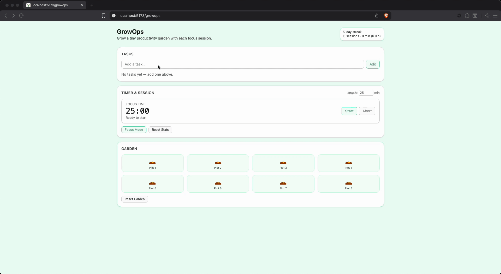

# 🌿 GrowOps

_Short tagline about what this project does_ 🦝

[](https://github.com/NickTheDevOpsGuy/GrowOps/actions/workflows/growsops-ci.yml)


---

## 🖼 Preview

### Main App Demo



---

## 🚀 Features

- 🌱 Pomodoro-style Focus Timer — start, abort, or complete sessions
- 🌾 Garden Growth — each session grows a random plant SVG
- 🪴 Dynamic Tasks — add, remove, and select tasks you’re working on
- 📆 Day Streak & Total Focus Tracker — persistent local stats
- 🌑 Focus Mode — minimal overlay with keyboard + backdrop exit
- 💾 Local Persistence — tasks, plants, and sessions saved in localStorage
- ♻️ Reset Garden — start fresh anytime

---

## 🗓️ Roadmap

- Animated growth transitions
- Garden “snapshot” export / share image
- Optional sound effects on completion
- Supabase sync (optional cloud save)
- Themed plant packs 🌻🌵🌸

---

## 🛠 Tech Stack

| Name | Description |
| :---- | :----------- |
| [React](https://react.dev/) | UI library for building interactive components. |
| [Vite](https://vitejs.dev/) | Lightning-fast development server and bundler. |
| [TypeScript](https://www.typescriptlang.org/) | Strongly typed JavaScript for safer, cleaner code. |
| [TailwindCSS](https://tailwindcss.com/) | Utility-first CSS framework for fast styling. |
| [localStorage API](https://developer.mozilla.org/docs/Web/API/Window/localStorage) | Client-side persistence for tasks, plants, and streaks. |

---

## 📦 Getting Started

1. **Clone the repository**

   ```bash
   git clone https://github.com/NickTheDevOpsGuy/GrowOps.git
   ```

2. **Install dependencies**

   ```bash
   npm install
   ```

3. **Run the development server**

   ```bash
   npm run dev
   ```

---

## 📂 Project Structure

<details>
<summary>📁 Click to expand file structure</summary>

```plaintext
.
├── .github
│   ├── ISSUE_TEMPLATE
│   │   ├── bug.yml
│   │   ├── config.yml
│   │   ├── documentation.yml
│   │   ├── enhancement_refactor.yml
│   │   ├── feature_request.yml
│   │   └── question_discussion.yml
│   ├── pull_request_template.md
│   └── workflows
│       └── growsops-ci.yml
├── .gitignore
├── .husky
│   ├── pre-commit
│   └── pre-push
├── .prettierignore
├── .prettierrc
├── .prettierrc.json
├── .prettierrc.yml
├── .stylelintrc.json
├── index.html
├── LICENSE
├── package-lock.json
├── package.json
├── public
├── README.md
├── scripts
│   └── precheck.sh
├── src
│   ├── .DS_Store
│   └── app
│       ├── .DS_Store
│       ├── App.tsx
│       ├── assets
│       │   └── .DS_Store
│       ├── components
│       │   ├── Card.tsx
│       │   ├── FocusTimer.tsx
│       │   ├── GardenGrid.tsx
│       │   ├── icons
│       │   │   ├── Bloom.tsx
│       │   │   ├── Bud.tsx
│       │   │   ├── index.ts
│       │   │   ├── Seed.tsx
│       │   │   └── Sprout.tsx
│       │   ├── PlantIcon.tsx
│       │   └── TaskList.tsx
│       ├── hooks
│       │   ├── useCountdown.ts
│       │   └── usePlantGrowth.ts
│       ├── lib
│       │   └── garden.ts
│       ├── main.tsx
│       ├── pages
│       │   └── TaskGarden.tsx
│       ├── state
│       │   └── session.ts
│       ├── styles
│       │   └── global.css
│       └── types
├── tsconfig.app.json
├── tsconfig.json
├── tsconfig.node.json
├── vite-env.d.ts
└── vite.config.ts
```

</details>

---

## 🤝 Contributing

- 🐛 Report bugs in [Issues](../../../../issues)
- 💡 Suggest features or improvements
- 🔧 Open a Pull Request

---

## 🦝 Built by NickDoesDevOps

Created with ☕, curiosity, and a touch of chaos by [Nicholas Clark](https://www.linkedin.com/in/nickdoesdevops).  
Follow the journey → [GitHub](https://github.com/NickTheDevOpsGuy) • [LinkedIn](https://www.linkedin.com/in/nickdoesdevops)

🏷 #NickDoesDevOps • #LearningInPublic • #BuiltInPublic
